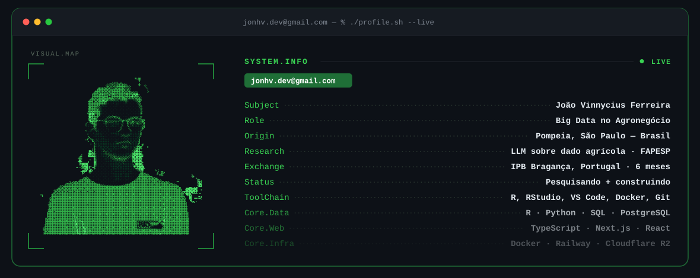
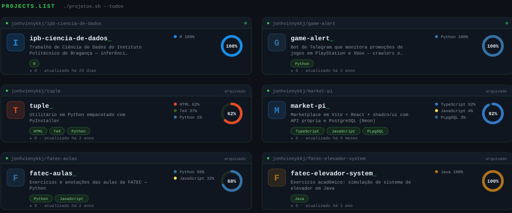

<!-- ===== FICHA ===== -->

<picture>
  <source media="(prefers-color-scheme: dark)" srcset="assets/heroi-dark.svg" />
  <source media="(prefers-color-scheme: light)" srcset="assets/heroi-light.svg" />
  
</picture>

<!-- ===== NÚMEROS ===== -->

<picture>
  <source media="(prefers-color-scheme: dark)" srcset="https://streak-stats.demolab.com/?user=jonhvinnykkj&amp;hide_border=true&amp;locale=pt_BR&amp;card_width=1180&amp;background=0d1117&amp;stroke=1f6f37&amp;ring=39d353&amp;fire=39d353&amp;currStreakLabel=39d353&amp;sideLabels=8b949e&amp;currStreakNum=e6edf3&amp;sideNums=e6edf3&amp;dates=6e7681&amp;titleColor=39d353" />
  
</picture>

 

<picture>
  <source media="(prefers-color-scheme: dark)" srcset="https://github-readme-stats-salesp07.vercel.app/api?username=jonhvinnykkj&amp;show_icons=true&amp;count_private=true&amp;include_all_commits=true&amp;hide_rank=true&amp;card_width=500&amp;hide_border=true&amp;locale=pt-br&amp;disable_animations=true&amp;cache_seconds=1800&amp;bg_color=0d1117&amp;title_color=39d353&amp;icon_color=26a641&amp;text_color=c9d1d9" />
  
</picture>
<picture>
  <source media="(prefers-color-scheme: dark)" srcset="https://github-readme-stats-salesp07.vercel.app/api/top-langs/?username=jonhvinnykkj&amp;layout=compact&amp;langs_count=8&amp;card_width=500&amp;hide_border=true&amp;locale=pt-br&amp;disable_animations=true&amp;cache_seconds=1800&amp;bg_color=0d1117&amp;title_color=39d353&amp;icon_color=26a641&amp;text_color=c9d1d9" />
  
</picture>

<!-- ===== COBRINHA — gerada por .github/workflows/cobrinha.yml ===== -->

<picture>
  <source media="(prefers-color-scheme: dark)" srcset="assets/cobrinha-dark.svg" />
  <source media="(prefers-color-scheme: light)" srcset="assets/cobrinha-light.svg" />
  
</picture>

<!-- ===== PROJETOS — gerado por .github/workflows/projetos.yml ===== -->

 

<picture>
  <source media="(prefers-color-scheme: dark)" srcset="assets/projetos-dark.svg" />
  <source media="(prefers-color-scheme: light)" srcset="assets/projetos-light.svg" />
  
</picture>

<!-- ===== CONTATO ===== -->

 

&nbsp;&nbsp;

&nbsp;&nbsp;

<!-- ===== FIM ===== -->
