<picture>
  <source media="(prefers-color-scheme: dark)" srcset="assets/header-dark.svg">
  <source media="(prefers-color-scheme: light)" srcset="assets/header-light.svg">
  
</picture>

Construo os sistemas internos que fazem uma operação de agronegócio funcionar: pesagem,
rastreabilidade, financeiro e o portal que junta tudo. A maior parte roda em produção e é
privada — a lista abaixo está aqui pelo escopo, não pelo link.

### Em produção

| Sistema | O que resolve | Stack |
|---|---|---|
| **Hub Progresso** | Portal central dos ~18 sistemas do grupo, com SSO e permissão por sistema | Next.js · Prisma · NextAuth |
| **Balança** | Controle de safra e pesagem de cargas, com termo LGPD assinado e comprovante em PDF | Express · Prisma · React |
| **Cotton App** | Rastreabilidade de fardos de algodão, do campo à indústria | Vite · Express · Drizzle |
| **Dashboard Financeiro** | Títulos, vencimentos e moeda estrangeira sobre a base do ERP | Python · PostgreSQL |
| **Sementes & Commodities** | Dashboard financeiro com câmbio USD por operação | FastAPI · Next.js |
| **Instituto Cultivar** | Plataforma do braço social do grupo, com CRM e gestão de projetos | Next.js 15 · Payload CMS 3 |
| **Site institucional** | Site do grupo, com mapa interativo dos representantes por estado | Vite · React · Express |
| **Pulso Digital** | Pesquisa de opinião interna: formulário anônimo + dashboard | Next.js 16 · Prisma |

### Também por aqui

**[PluView](https://github.com/FhSoftwareSolutions)** — telemetria de estações meteorológicas em
fazenda, com dashboard web. Firmware, API e front.
**[game-alert](https://github.com/jonhvinnykkj/game-alert)** — bot de Telegram que monitora
promoções de jogos em PlayStation e Xbox.
Para clientes: site e credenciamento de eventos da agência E+, marketplace de hospedagem.

### Stack

`TypeScript` `Next.js` `React` `Vite` `Tailwind` — front
`Node/Express` `FastAPI` `Prisma` `Drizzle` — back
`PostgreSQL` `Railway` `Docker` `Cloudflare R2` — dados e infra

Onde mora o atrito real desse tipo de sistema, e onde eu passo a maior parte do tempo:
integração com ERP legado (TOTVS) e geração de relatório e PDF no servidor.

### Contato

[midia@grupoprogresso.agr.br](mailto:midia@grupoprogresso.agr.br)

<!-- perfil -->
