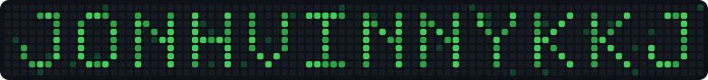
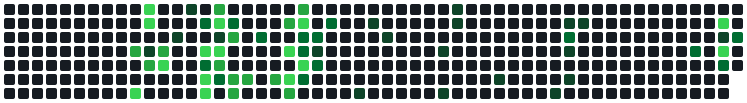

<picture>
  <source media="(prefers-color-scheme: dark)" srcset="assets/name-pixel-dark.svg" />
  <source media="(prefers-color-scheme: light)" srcset="assets/name-pixel-light.svg" />
  
</picture>

<h3>Sistemas internos para o agronegócio &nbsp;|&nbsp; Full Stack &amp; Dados</h3>

  <b>Construo os sistemas que fazem uma operação de agronegócio funcionar</b> 
  Pesagem &nbsp;·&nbsp; Rastreabilidade &nbsp;·&nbsp; Financeiro &nbsp;·&nbsp; e o portal que junta tudo

---

## 👋 Sobre mim

Trabalho no que quase nunca aparece: o software interno que sustenta a operação de um grupo do
agronegócio. Balança de caminhão, fardo de algodão saindo do campo, título vencendo no ERP — cada
uma dessas coisas vira tela, relatório e decisão.

A maior parte do que construo **roda em produção e é privada**. A lista abaixo está aqui pelo
escopo, não pelo link.

- 🌾 Sistemas internos de **pesagem, rastreabilidade e financeiro** para o agro
- 🧩 Portal central com **SSO e permissão por sistema** para ~18 aplicações do grupo
- 🔌 Integração com **ERP legado (TOTVS)** e geração de relatório e PDF no servidor
- 🐳 **Docker + Railway** para deploy e ambientes reproduzíveis
- 📍 Pompeia — SP &nbsp;·&nbsp; [@FhSoftwareSolutions](https://github.com/FhSoftwareSolutions)

---

## 🚜 Em produção

> Onde mora o atrito real desse tipo de sistema — e onde eu passo a maior parte do tempo — é na
> integração com o ERP legado e na geração de relatório e PDF no servidor.

| Sistema | O que resolve | Stack |
| :--- | :--- | :--- |
| **Hub Progresso** | Portal central dos ~18 sistemas do grupo, com SSO e permissão por sistema | Next.js · Prisma · NextAuth |
| **Balança** | Controle de safra e pesagem de cargas, com termo LGPD assinado e comprovante em PDF | Express · Prisma · React |
| **Cotton App** | Rastreabilidade de fardos de algodão, do campo à indústria | Vite · Express · Drizzle |
| **Dashboard Financeiro** | Títulos, vencimentos e moeda estrangeira sobre a base do ERP | Python · PostgreSQL |
| **Sementes & Commodities** | Dashboard financeiro com câmbio USD por operação | FastAPI · Next.js |
| **Instituto Cultivar** | Plataforma do braço social do grupo, com CRM e gestão de projetos | Next.js 15 · Payload CMS 3 |
| **Site institucional** | Site do grupo, com mapa interativo dos representantes por estado | Vite · React · Express |
| **Pulso Digital** | Pesquisa de opinião interna: formulário anônimo + dashboard | Next.js 16 · Prisma |

---

## 🛠️ Tecnologias & Ferramentas

### Linguagens

### Front-end

### Back-end &amp; Dados

### DevOps &amp; Ferramentas

 

---

## 🧩 Onde cada peça entra

| Camada | O que uso e por quê |
| :--- | :--- |
| **Front** | `Next.js` para o que precisa de SSR e rota protegida · `Vite + React` para painel interno rápido |
| **Back** | `Node/Express` no que é CRUD e regra de negócio · `FastAPI` quando o peso está no cálculo e no dado |
| **Dados** | `Prisma` e `Drizzle` sobre `PostgreSQL` — schema versionado e migração à mão quando precisa |
| **ERP** | Leitura da base legada do TOTVS: normalização de moeda, vencimento e título antes de virar tela |
| **Documento** | `Puppeteer` para comprovante e termo LGPD assinado em PDF, gerados no servidor |
| **Infra** | `Docker` e `Railway` para deploy · `Cloudflare R2` para arquivo e mídia |

---

## 📦 Também por aqui

- **[PluView](https://github.com/FhSoftwareSolutions)** — telemetria de estações meteorológicas em fazenda, com dashboard web. Firmware, API e front.
- **[game-alert](https://github.com/jonhvinnykkj/game-alert)** — bot de Telegram que monitora promoções de jogos em PlayStation e Xbox.
- **[market-pi](https://github.com/jonhvinnykkj/market-pi)** — marketplace em Vite + React + shadcn/ui com API própria e PostgreSQL.
- Para clientes: site e credenciamento de eventos da agência E+, marketplace de hospedagem.

---

## 📊 Estatísticas do GitHub

<picture>
  <source media="(prefers-color-scheme: dark)" srcset="https://github-readme-stats-salesp07.vercel.app/api?username=jonhvinnykkj&amp;show_icons=true&amp;include_all_commits=true&amp;count_private=true&amp;hide_border=true&amp;locale=pt-br&amp;disable_animations=true&amp;cache_seconds=1800&amp;bg_color=0d1117&amp;title_color=39d353&amp;icon_color=26a641&amp;text_color=c9d1d9" />
  <source media="(prefers-color-scheme: light)" srcset="https://github-readme-stats-salesp07.vercel.app/api?username=jonhvinnykkj&amp;show_icons=true&amp;include_all_commits=true&amp;count_private=true&amp;hide_border=true&amp;locale=pt-br&amp;disable_animations=true&amp;cache_seconds=1800&amp;bg_color=ffffff&amp;title_color=216e39&amp;icon_color=30a14e&amp;text_color=24292f" />
  
</picture>
<picture>
  <source media="(prefers-color-scheme: dark)" srcset="https://github-readme-stats-salesp07.vercel.app/api/top-langs/?username=jonhvinnykkj&amp;layout=compact&amp;langs_count=8&amp;hide_border=true&amp;locale=pt-br&amp;disable_animations=true&amp;cache_seconds=1800&amp;bg_color=0d1117&amp;title_color=39d353&amp;icon_color=26a641&amp;text_color=c9d1d9" />
  <source media="(prefers-color-scheme: light)" srcset="https://github-readme-stats-salesp07.vercel.app/api/top-langs/?username=jonhvinnykkj&amp;layout=compact&amp;langs_count=8&amp;hide_border=true&amp;locale=pt-br&amp;disable_animations=true&amp;cache_seconds=1800&amp;bg_color=ffffff&amp;title_color=216e39&amp;icon_color=30a14e&amp;text_color=24292f" />
  
</picture>

---

## 📫 Vamos conversar?

 

📧 **E-mail:** [midia@grupoprogresso.agr.br](mailto:midia@grupoprogresso.agr.br)  
🐙 **GitHub:** [@jonhvinnykkj](https://github.com/jonhvinnykkj)  
🏢 **Organização:** [@FhSoftwareSolutions](https://github.com/FhSoftwareSolutions)

---

*"Sistema interno bom é o que ninguém percebe: a carga pesa, o fardo é rastreado, o título fecha."*

<picture>
  <source media="(prefers-color-scheme: dark)" srcset="assets/contrib-grid-dark.svg" />
  <source media="(prefers-color-scheme: light)" srcset="assets/contrib-grid-light.svg" />
  
</picture>

