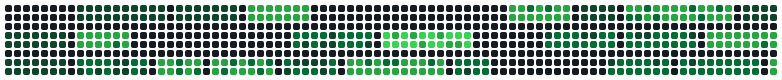
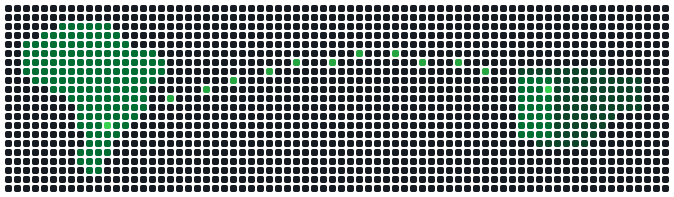

<picture>
  <source media="(prefers-color-scheme: dark)" srcset="assets/name-pixel-dark.svg" />
  <source media="(prefers-color-scheme: light)" srcset="assets/name-pixel-light.svg" />
  
</picture>

<h3>Big Data no Agronegócio &nbsp;|&nbsp; Inteligência artificial aplicada ao campo</h3>

  <b>Iniciação científica FAPESP</b> — modelos de linguagem sobre dados agrícolas 
  FATEC Pompeia &nbsp;·&nbsp; intercâmbio de 6 meses no Instituto Politécnico de Bragança 🇵🇹

<picture>
  <source media="(prefers-color-scheme: dark)" srcset="assets/talhoes-dark.svg" />
  <source media="(prefers-color-scheme: light)" srcset="assets/talhoes-light.svg" />
  
</picture>

  

---

## 🔬 Pesquisa

> O dado agronômico raramente nasce em tabela. Ele nasce em laudo, boletim de campo, recomendação
> técnica, caderno de talhão e planilha improvisada. A pergunta que persigo é o que um modelo de
> linguagem consegue **ler, estruturar e responder** em cima desse material — e onde ele erra de um
> jeito que um agrônomo não erraria.

| | |
| :--- | :--- |
| **Programa** | Iniciação científica — FAPESP |
| **Área** | Inteligência artificial aplicada ao agronegócio |
| **Recorte** | Modelos de linguagem sobre dados e documentos agrícolas |
| **Instituição** | FATEC Pompeia — Tecnologia em Big Data no Agronegócio |
| **Situação** | em andamento |

O que me interessa não é o modelo em si, e sim o que vem antes e depois dele: a **procedência do
dado** que entra, e se a resposta que sai é auditável por quem responde pela lavoura.

---

## 🎓 Formação

| | |
| :--- | :--- |
| **FATEC Pompeia** | Tecnologia em **Big Data no Agronegócio** — estatística, banco de dados, mineração de dados e agricultura de precisão |
| **IPB — Bragança 🇵🇹** | Intercâmbio de 6 meses: **gestão e governança de dados**, ciência de dados em **R**, modelagem de processos de negócio, segurança da informação e análise de investimentos |
| **Iniciação científica** | FAPESP — IA aplicada ao agro |

<picture>
  <source media="(prefers-color-scheme: dark)" srcset="assets/rota-dark.svg" />
  <source media="(prefers-color-scheme: light)" srcset="assets/rota-light.svg" />
  
</picture>

<b>Pompeia, SP</b> &nbsp;──────→&nbsp; <b>Bragança, Portugal</b> &nbsp;·&nbsp; 6 meses

---

## 📐 Governança de dados & análise em R

O que trouxe de Bragança, e o que hoje sustenta o resto:

| Frente | O que envolve |
| :--- | :--- |
| **Governança** | Catálogo e dicionário de dados · linhagem e proveniência · qualidade e regras de validação · propriedade e papéis sobre o dado · ciclo de vida · LGPD e RGPD |
| **Estatística aplicada** | Descritiva e exploratória · testes de hipótese (`t`, `qui-quadrado`, `Shapiro-Wilk`, `F`) · ANOVA · testes não-paramétricos · correlação e regressão linear |
| **Análise em R** | `read.csv` → `factor` → EDA → histograma, boxplot, matriz de correlação → inferência. O ciclo inteiro em script versionado, não em planilha |
| **Processos** | Modelagem de processo de negócio: onde o dado é gerado, quem toca nele e onde ele se perde |

---

## 🛠️ Ferramentas

### Dados & análise

### Desenvolvimento

### Ambiente

 

             

---

## 💾 Fora da faculdade

Também construo sistema interno para uma operação de agronegócio: pesagem de carga, rastreabilidade
de fardo, financeiro sobre a base do ERP e o portal que junta tudo. É software privado — está aqui
como contexto, não como link.

O que dá pra abrir:

- **[game-alert](https://github.com/jonhvinnykkj/game-alert)** — bot de Telegram que monitora promoções de jogos em PlayStation e Xbox. Crawlers em Python.
- **[market-pi](https://github.com/jonhvinnykkj/market-pi)** — marketplace em Vite + React com API própria e PostgreSQL.
- **[fatec-*](https://github.com/jonhvinnykkj?tab=repositories&q=fatec)** — exercícios das disciplinas: Java, Python, banco de dados, estatística.

---

## 📊 Estatísticas do GitHub

<picture>
  <source media="(prefers-color-scheme: dark)" srcset="https://github-readme-stats-salesp07.vercel.app/api?username=jonhvinnykkj&amp;show_icons=true&amp;include_all_commits=true&amp;count_private=true&amp;hide_border=true&amp;locale=pt-br&amp;disable_animations=true&amp;cache_seconds=1800&amp;bg_color=0d1117&amp;title_color=39d353&amp;icon_color=26a641&amp;text_color=c9d1d9" />
  <source media="(prefers-color-scheme: light)" srcset="https://github-readme-stats-salesp07.vercel.app/api?username=jonhvinnykkj&amp;show_icons=true&amp;include_all_commits=true&amp;count_private=true&amp;hide_border=true&amp;locale=pt-br&amp;disable_animations=true&amp;cache_seconds=1800&amp;bg_color=ffffff&amp;title_color=216e39&amp;icon_color=30a14e&amp;text_color=24292f" />
  
</picture>
<picture>
  <source media="(prefers-color-scheme: dark)" srcset="https://github-readme-stats-salesp07.vercel.app/api/top-langs/?username=jonhvinnykkj&amp;layout=compact&amp;langs_count=8&amp;hide_border=true&amp;locale=pt-br&amp;disable_animations=true&amp;cache_seconds=1800&amp;bg_color=0d1117&amp;title_color=39d353&amp;text_color=c9d1d9" />
  <source media="(prefers-color-scheme: light)" srcset="https://github-readme-stats-salesp07.vercel.app/api/top-langs/?username=jonhvinnykkj&amp;layout=compact&amp;langs_count=8&amp;hide_border=true&amp;locale=pt-br&amp;disable_animations=true&amp;cache_seconds=1800&amp;bg_color=ffffff&amp;title_color=216e39&amp;text_color=24292f" />
  
</picture>

---

## 📫 Contato

  

📧 [midia@grupoprogresso.agr.br](mailto:midia@grupoprogresso.agr.br) &nbsp;·&nbsp; 📍 Pompeia — SP

---

*"O modelo é a parte fácil. O difícil é saber de onde veio o dado que ele leu."*

<picture>
  <source media="(prefers-color-scheme: dark)" srcset="assets/contrib-grid-dark.svg" />
  <source media="(prefers-color-scheme: light)" srcset="assets/contrib-grid-light.svg" />
  
</picture>

